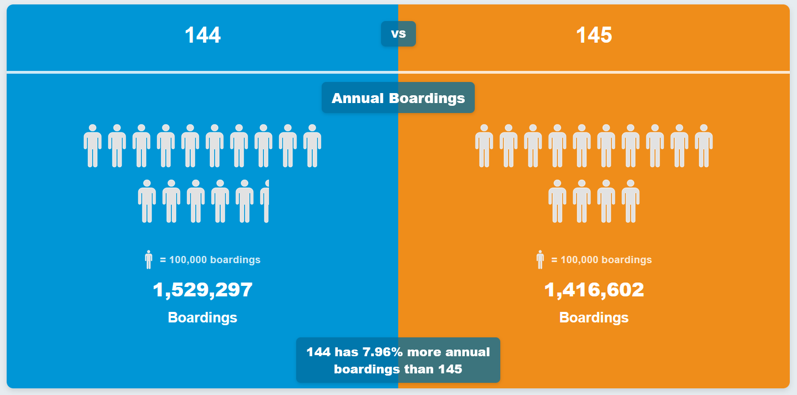

# TransLink-Performance-Explorer

Live Project: https://translink-performance-explorer.onrender.com/

## What is TransLink-Performance-Explorer?

TransLink Performance Explorer is a web application designed to help users analyze and visualize transit 
performance data. It allows users to easily explore and compare performance metrics between each other as well as create custom visualizations. It utilizes the TSPR CSV files provided by TransLink as its data source.

## Features

● My 2 Bus Lines: Lets you compare any 2 bus lines on TransLink's System. Reveals stats such as annual and daily ridership, revenue hours, boardings per hour and peak passenger loads, overcrowding metrics, and more!

● My 2 Stations: Lets you compare any 2 SkyTrain Stations on Translink's System. Reveals stats such as annual and daily ridership, as well as boardings and alightings per hour.

● Greater/Less Than: Reveals the bus lines/SkyTrain stations that satisfies a given requirement in a given metric. Ex. Reveal bus lines with more than 1,000,000 boardings per year.

● Similar To: Reveals bus lines/SkyTrain stations that are most closely related to your given bus line/station in a given metric. Like a "recommendation" finder.

● My 2 Years: Reveals bus lines/SkyTrain stations that had the biggest change (+ and -) in each given metric over the 2 chosen years. From this, you can also choose any individual bus line/SkyTrain station and reveal their change over the 2 years.

● Deep Bus Line Comparison: Compares any 2 bus line stat subsections. That is, by day of the week (MF, Sat, Sun), Season (Fall, Summer), and Time Range (4, 6, 9, 15, 18, 21, 24). Here, you can compare not only different bus lines of the same subsection (day, season, and time range shared), but also same bus line of different subsections, or even mix it up (ex. compare if a bus line has more ridership late night than another during rush hour).

## Possible Future Features

● Fun minigame: Bus line/SkyTrain station trivia: which bus line has more riders/the most amount of riders? Other questions: Which has more overcrowding? Higher speed?

## Preview

## Notes

● Image credit for My 2 Stations goes to Wikimedia Commons, where all images are licensed under Creative Commons. Images are found from the station's main Wikipedia page.

● Not affiliated or supported by TransLink

● Uses MIT License

## How to use (as of now)

1. Download files to your computer

2. On terminal, navigate to the file "TransLink-Performance-Explorer" or "TransLink-Performance-Explorer-main" (the deeper folder if another folder of the same name found within it)

3. Type command: python app.py

4. On browser, open: http://127.0.0.1:5000/

5. Use as a webapp!