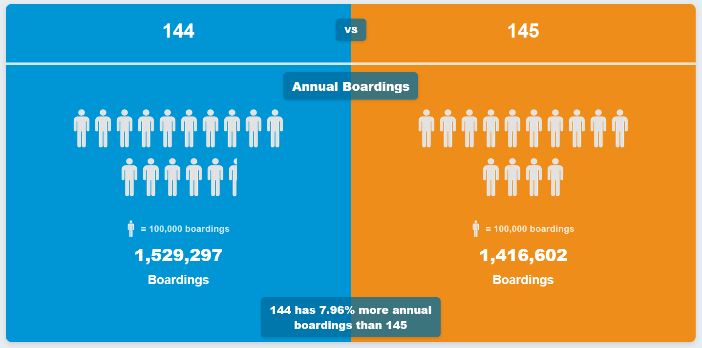

# TransLink-Performance-Explorer

Live Project: https://translink-performance-explorer.onrender.com/

## What is TransLink-Performance-Explorer?

TransLink Performance Explorer is a web application designed to help users analyze and visualize transit 
performance data. It allows users to easily explore and compare performance metrics between each other as well as create custom visualizations. It utilizes the TSPR CSV files provided by TransLink as its data source.

## Features

● My 2 Bus Lines: Lets you compare any 2 bus lines on TransLink's System. Reveals stats such as annual and daily ridership, revenue hours, boardings per hour and peak passenger loads, overcrowding metrics, and more!

● My 2 Stations: Lets you compare any 2 SkyTrain Stations on Translink's System. Reveals stats such as annual and daily ridership, as well as boardings and alightings per hour.

● Greater/Less Than: Reveals the bus lines/SkyTrain stations that satisfies a given requirement in a given metric. Ex. Reveal bus lines with more than 1,000,000 boardings per year.

● Similar To: Reveals bus lines/SkyTrain stations that are most closely related to your given bus line/station in a given metric. Like a "recommendation" finder.

● My 2 Years: Reveals bus lines/SkyTrain stations that had the biggest change (+ and -) in each given metric over the 2 chosen years. From this, you can also choose any individual bus line/SkyTrain station and reveal their change over the 2 years.

● Deep Bus Line Comparison: Compares any 2 bus line stat subsections. That is, by day of the week (MF, Sat, Sun), Season (Fall, Summer), and Time Range (4, 6, 9, 15, 18, 21, 24). Here, you can compare not only different bus lines of the same subsection (day, season, and time range shared), but also same bus line of different subsections, or even mix it up (ex. compare if a bus line has more ridership late night than another during rush hour).

● Am I Faster: Takes your running time for a given distance and reveals the bus lines that you are faster than

## 3D Map Features

● 3D SkyTrain Station Usage Map: Reveals the usage of each SkyTrain station in a 3D map, where the height of each station corresponds to its ridership. This allows users to easily visualize and compare the popularity of different stations across the network, as well as create a "breathing" effect that occurs over peak hours over a day.

● 3D Bus Stop Usage Map: Reveals the usage of each bus stop in a 3D map, where the height of each stop corresponds to its usage (boardings, alightings, total).

● 3D Skytrain Segment Usage Map: Reveals the usage of each SkyTrain segment in a 3D map, where the size of each segment tube corresponds to its ridership usage.

● 3D Bus Line Usage Map: Reveals the usage of each bus line in a 3D map, where the width or color of each line corresponds to its ridership, usage, crowding, speed, ontime performance and more.

## Preview

Comparing ridership of 144 and 145



3D Data Maps


## Notes

● Image credit for My 2 Stations goes to Wikimedia Commons, where all images are licensed under Creative Commons. Images are found from the station's main Wikipedia page.

● SkyTrain Stations and Bus Stops are located using TransLink's GTFS data and TSPR Catalog, which provides the latitude and longitude of each station and stop.

● SkyTrain Segments were manually made using google my maps.

● Bus Lines were mapped using this provided google my maps: https://www.google.com/maps/d/viewer?hl=en&mid=1pmQlG8105ELNbdnWDOfuMOfXEcETQqFX&ll=49.23984696853358%2C-122.68972059999999&z=10

● Not affiliated or supported by TransLink

● Uses MIT License

## How to Host Locally

1. Download ZIP and extract files into a selected folder.

2. Using a terminal (with command prompt or an IDE of your choice), navigate to the selected folder, then to the Translink-Performance-Explorer-main folder, by typing the following:

```bash
cd Translink-Performance-Explorer-main
```

3. Type in terminal: 

```bash
python app.py
```


4. Open your browser at http://127.0.0.1:5000/ and use as a webapp!